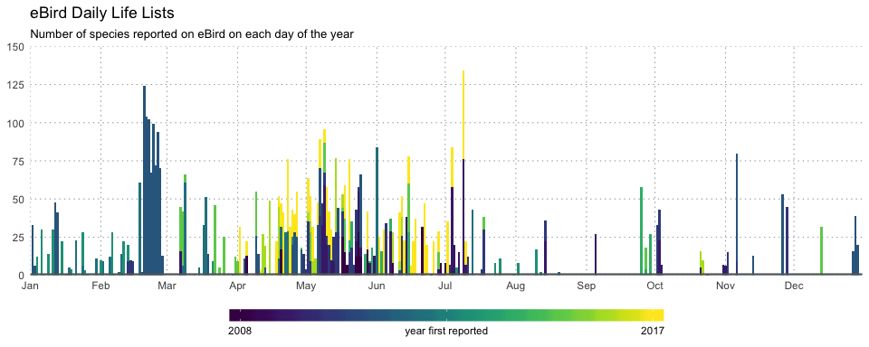

<!-- README.md is generated from README.Rmd. Please edit that file -->
auklet: Analysis and visualization of your eBird sightings
==========================================================

`auklet` provides tools for analyzing and visualizing your personal [eBird](http://ebird.org) data. Your personal sightings can be downloaded as a CSV file from the [Download My Data](http://ebird.org/ebird/downloadMyData) page on the eBird website.

Installation
------------

Install `auklet` from GitHub using:

``` r
# install.packages("devtools")
devtools::install_github("mstrimas/auklet")
```

Usage
-----

All functions in `auklet` begin with `eb_` (for eBird) to aid tab completion. Import your eBird sightings data into a data frame with `eb_sightings()`:

``` r
library(auklet)
library(dplyr)
# load example data inclued with the package
ebird_data <- system.file("extdata/MyEBirdData.csv", package = "auklet") %>%
  eb_sightings()
```

Once your eBird data are imported, you can begin summarizing and visualizing them. The most basic functionality is generating your life list.

``` r
eb_lifelist(ebird_data) %>% 
  select(species_common, date, country) %>% 
  head()
#> # A tibble: 6 x 3
#>                 species_common       date country
#>                          <chr>     <date>   <chr>
#> 1   White-faced Whistling-Duck 2014-06-03      CO
#> 2 Black-bellied Whistling-Duck 2014-05-27      CO
#> 3  Greater White-fronted Goose 2011-02-20      US
#> 4                   Snow Goose 2011-02-20      US
#> 5                 Ross's Goose 2011-02-20      US
#> 6                        Brant 2011-02-21      US
```

Life lists can, of course, be viewed directly on the eBird website; however, other functions produce summaries or visualizations not available in eBird. For example, use `eb_lifelist_day()` to creat daily life lists, i.e. a data frame of species seen on each day of the year.

``` r
day_lists <- eb_lifelist_day(ebird_data)
# species seen on feb 14
filter(day_lists, month == 2, day == 14) %>% 
  select(month, day, species_common)
#> # A tibble: 10 x 3
#>    month   day           species_common
#>    <dbl> <int>                    <chr>
#>  1     2    14            Brown Pelican
#>  2     2    14        California Condor
#>  3     2    14     California Scrub-Jay
#>  4     2    14 Double-crested Cormorant
#>  5     2    14         Great Blue Heron
#>  6     2    14              Great Egret
#>  7     2    14          Red-tailed Hawk
#>  8     2    14           Turkey Vulture
#>  9     2    14         Western Bluebird
#> 10     2    14     White-throated Swift
```

These day lists can be summarized to daily counts with `summary()` or visualized with `plot()`.

``` r
summary(day_lists) %>% 
  head()
#> # A tibble: 6 x 3
#>   month   day     n
#>   <dbl> <int> <int>
#> 1     1     1    23
#> 2     1     2    33
#> 3     1     3     6
#> 4     1     4    12
#> 5     1     6    30
#> 6     1     7     1
plot(day_lists)
```



Acknowledgments
---------------

This package, and some of the specific functionality, was inspired by conversations with [Drew Weber](http://www.nemesisbird.com/), [Taylor Long](http://www.mtaylorlong.com/), and Tom Auer.
